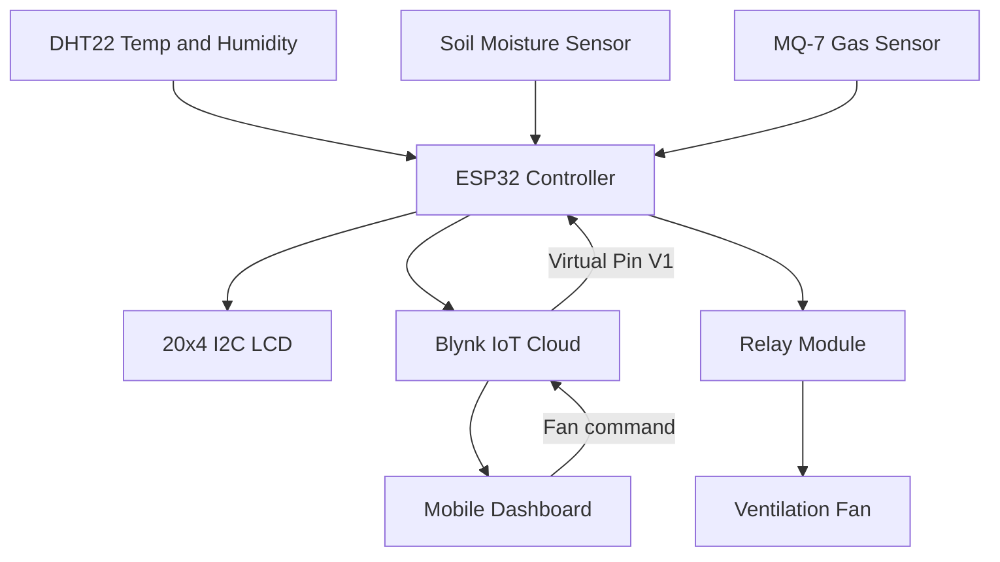

## Introduction

Mushroom cultivation depends on keeping the growing environment within a narrow range of temperature, humidity, soil moisture, and air quality. Checking those values by hand is slow and inconsistent, and a single missed reading can spoil a batch. I built this project to collect environmental data automatically and make it visible both at the growing site and from a phone, so the conditions can be corrected before they become a problem.

## Project Overview

| Category | Details |
| --- | --- |
| Project Name | IoT Based Mushroom Environment Monitoring System |
| Purpose | Monitor and maintain suitable conditions for mushroom cultivation |
| Tech Stack | ESP32, DHT22, MQ-7 gas sensor, soil moisture sensor, 20x4 I2C LCD, relay module, Blynk IoT, Arduino IDE |
| Role/Contributions | Firmware development, sensor integration, LCD output, Blynk dashboard setup, and remote fan control |

The system uses an ESP32 as the central controller. Several sensors feed data into the microcontroller, which then displays the readings on a local LCD and uploads them to the Blynk cloud platform. From the Blynk mobile app, a user can watch the live values and toggle a ventilation fan through a relay. Everything runs on a one-second timer, so the dashboard and the LCD stay current without any manual refresh.

## Architecture / How It Works




The ESP32 reads all sensors on a fixed interval, then writes the results to the LCD and to Blynk virtual pins. The mobile app subscribes to those pins for monitoring, and the fan switch on pin `V1` travels back down to the device, where it drives the relay. This keeps the local and remote views consistent because both come from the same sensor read.

## Key Implementation Details


### Converting raw sensor values into readable data

The soil moisture sensor returns an analog value from `0` to `4095`. Raw numbers are hard to interpret, so I mapped them to a percentage where a higher value means wetter soil.

```cpp
// On the ESP32, a dry sensor reads near 4095 and a wet one reads near 0.
int rawValue = analogRead(SOIL_PIN);
int soilPercent = map(rawValue, 4095, 0, 0, 100);
soilPercent = constrain(soilPercent, 0, 100);
```

Temperature and humidity come from a DHT22, and I added a guard for failed reads so a bad sample never reaches the dashboard.

```cpp
float humidity = dht.readHumidity();
float temperature = dht.readTemperature();

if (isnan(humidity) || isnan(temperature)) {
    Serial.println("Failed to read from DHT sensor");
    return;
}
```

### Displaying live data on the LCD


A 20x4 I2C LCD shows the current conditions locally. Each row is assigned to one reading so the layout stays stable and easy to scan at a glance.

```cpp
lcd.setCursor(0, 0);
lcd.print("Humidity: ");
lcd.print(humidity);
lcd.print("%");
```

| Row | Information Displayed |
| --- | --- |
| Row 1 | Humidity value |
| Row 2 | Temperature value |
| Row 3 | Soil moisture percentage and water status |
| Row 4 | Gas sensor reading |

### Sending data to the Blynk dashboard


The ESP32 publishes each value to a Blynk virtual pin. The mobile dashboard binds widgets to these pins, which separates the display layer from the firmware logic.

```cpp
Blynk.virtualWrite(V5, humidity);
Blynk.virtualWrite(V6, temperature);
Blynk.virtualWrite(V7, soilPercent);
Blynk.virtualWrite(V8, gasValue);
```

| Virtual Pin | Function |
| --- | --- |
| V1 | Fan control switch |
| V5 | Humidity value |
| V6 | Temperature value |
| V7 | Soil moisture percentage |
| V8 | Gas sensor raw value |
| V9 | Water detection indicator |
| V10 | Gas detection indicator |

One setup detail that caused confusion at first is that the Blynk template ID, template name, and auth token must be defined before the Blynk library is included, otherwise the connection fails to authenticate.

### Remote fan control and gas alerts

A relay module switches the ventilation fan. When the user flips the switch in the app, Blynk invokes the handler for pin `V1` on the device.

```cpp
BLYNK_WRITE(V1) {
    int fanState = param.asInt();
    digitalWrite(RELAY_PIN, fanState ? HIGH : LOW);
}
```

The MQ-7 gas sensor is compared against a threshold, and the result is pushed to a dedicated indicator pin.

```cpp
if (gasValue > GAS_THRESHOLD) {
    Blynk.virtualWrite(V10, 1);
} else {
    Blynk.virtualWrite(V10, 0);
}
```

### Running the monitoring loop on a timer

Rather than reading sensors directly inside `loop()`, I scheduled the work with the Blynk timer. This keeps the connection serviced while readings happen on a predictable cadence.

```cpp
// Read sensors, refresh the LCD, and push data every second.
timer.setInterval(1000L, readAndSendSensors);
```

The main loop stays minimal:

```cpp
void loop() {
    Blynk.run();
    timer.run();
}
```

## Challenges & Lessons Learned

- Sensor noise made single readings unreliable, so I smoothed the values and validated DHT reads before displaying or uploading them.
- The ESP32 analog input tops out at 4095, and the soil sensor behaves inversely to what I expected. I had to confirm the wet and dry endpoints before trusting the percentage.
- Blynk initialization order matters. Defining the template parameters after including the library broke authentication and cost me a debugging session.
- Blocking code in `loop()` would drop the cloud connection, so moving sensor work into a timer was the right call.
- Next I would add automated climate control and data logging, so the system reacts to thresholds instead of only reporting them.

## Results / Impact

- The system monitors temperature, humidity, soil moisture, and gas levels continuously on a one-second interval.
- Environmental data is available locally on the LCD and remotely through the Blynk mobile dashboard at the same time.
- The ventilation fan can be controlled remotely, reducing the need to physically visit the growing area.
- The project supports sustainable agriculture and aligns with the UN Sustainable Development Goals for Zero Hunger, Industry, Innovation and Infrastructure, Responsible Consumption and Production, and Climate Action.

## Conclusion


This project showed me how much of IoT work is integration rather than a single clever algorithm. Getting the sensors, the LCD, the relay, and the cloud to agree on the same data at the same time was the real challenge. The result is a small but practical system that keeps a mushroom growing environment visible and controllable from anywhere.

## Links

- [GitHub Repository](https://github.com/tanviruman/IoT-Based-Mushroom-Environment-Monitoring-System)
