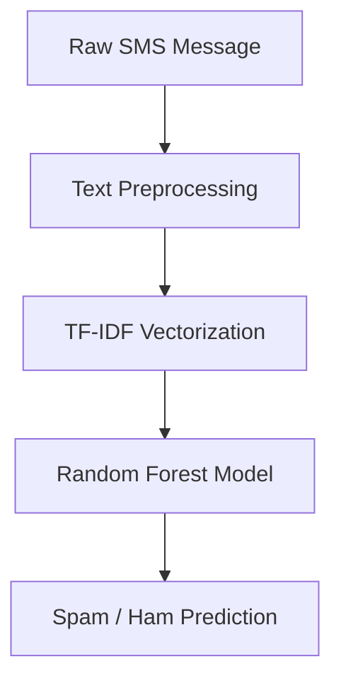

## Introduction

Unwanted SMS messages are a simple but practical text-classification problem: a system needs to distinguish legitimate messages from promotional or fraudulent ones without relying on manually written rules. I built this project to understand the complete NLP and machine-learning workflow, from cleaning raw SMS text to training multiple classifiers and deploying a reusable prediction pipeline.

The project ultimately compares three classical machine-learning models with a recurrent neural network (RNN). The final Random Forest model achieved the strongest overall test performance, with an accuracy of 97.16% and an F1 score of 87.50%.

## Project Overview

| Category | Details |
| --- | --- |
| Project Name | SMS Spam Detection |
| Purpose | Classify SMS messages as Spam or Ham |
| Tech Stack | Python, Pandas, NumPy, NLTK, Scikit-learn, TensorFlow, Matplotlib, Seaborn, Pickle |
| Role/Contributions | End-to-end implementation: EDA, NLP preprocessing, feature engineering, model training, evaluation, visualization, and prediction pipeline |

The project uses the SMS Spam Collection dataset and converts raw messages into features that machine-learning models can process. The NLP pipeline includes lowercasing, punctuation and special-character removal, tokenization, stopword removal, and stemming. After preprocessing, I used TF-IDF to represent the text numerically for the classical machine-learning models.

I trained Multinomial Naive Bayes, Logistic Regression, and Random Forest models and evaluated them using accuracy, precision, recall, and F1 score. I also built an RNN using an embedding layer, SimpleRNN, and dense layers. The repository contains separate notebooks for each major stage as well as reusable Python modules under `src/`.

## Architecture / How It Works

The main prediction pipeline is:



For training, the data first goes through exploratory data analysis and NLP preprocessing. The cleaned text is transformed using `TfidfVectorizer(max_features=5000)`, and the resulting feature matrix is used to train the classical models. The project also has a separate deep-learning path where text is tokenized, converted into sequences, padded, and passed through an embedding layer and SimpleRNN.

The repository separates experimentation from reusable code: Jupyter notebooks contain the step-by-step development process, while `src/` contains preprocessing, feature-engineering, evaluation, and prediction modules. Trained artifacts such as the TF-IDF vectorizer, classical models, RNN tokenizer, and RNN model are stored under `models/`.

## Key Implementation Details

### Building a reusable NLP preprocessing pipeline

Rather than cleaning text independently in every notebook, I moved the preprocessing logic into `src/nlp_preprocessing.py`. This made it possible to apply the same transformations during both model development and prediction.

The preprocessing sequence includes lowercasing, punctuation removal, special-character and number removal, tokenization, stopword removal, and stemming.

```python
def preprocess_text(text):
    text = text.lower()
    text = remove_punctuation(text)
    text = remove_special_characters(text)

    tokens = tokenize_text(text)
    tokens = remove_stopwords(tokens)
    tokens = stem_words(tokens)

    return " ".join(tokens)
```

The important design decision here was consistency: the same preprocessing function is reused when a new SMS is passed to the prediction pipeline.

### Converting text into numerical features

Machine-learning models cannot directly consume raw sentences, so I used TF-IDF to represent each message numerically.

```python
from sklearn.feature_extraction.text import TfidfVectorizer

# Limit the vocabulary to the 5,000 most useful features.
tfidf = TfidfVectorizer(max_features=5000)

X = tfidf.fit_transform(df["processed_message"])
```

I saved the fitted vectorizer as `tfidf_vectorizer.pkl`. This is important because prediction must use the same vocabulary and learned IDF weights that were created during training. The repository stores this vectorizer alongside the trained models.

### Comparing classical machine-learning models

I wanted to avoid assuming that a more complex model would automatically perform better. I therefore compared Naive Bayes, Logistic Regression, and Random Forest using the same text representation.

```python
models = {
    "Naive Bayes": nb_model,
    "Logistic Regression": lr_model,
    "Random Forest": rf_model
}

# Train each candidate using the same TF-IDF feature matrix.
for name, model in models.items():
    model.fit(X_train, y_train)
```

The evaluation used accuracy, precision, recall, and F1 score. F1 was particularly important because the dataset is imbalanced, with Spam representing a much smaller portion of the messages. The repository documents a 70/15/15 train/validation/test split with stratified sampling.

### Handling class imbalance in the RNN

One of the most useful debugging experiences came from the RNN. My first RNN effectively learned to predict every test message as Ham. It achieved roughly 87% accuracy, but that number was misleading because Ham was the majority class.

I confirmed the problem by checking the prediction distribution. I then introduced class weights so that mistakes on the minority Spam class carried a larger training penalty.

```python
class_weight = {
    0: 1.0,
    1: 6.9
}

# Give the minority Spam class a larger training weight.
history = rnn_model.fit(
    X_train,
    y_train,
    validation_data=(X_val, y_val),
    epochs=10,
    batch_size=32,
    class_weight=class_weight
)
```

After retraining, the RNN reached 96.01% accuracy, 83.84% precision, 84.69% recall, and an 84.26% F1 score. The repository records tokenization, sequence encoding, padding, and class-weight balancing as part of the RNN workflow.

## Challenges & Lessons Learned

- Class imbalance affected the RNN significantly. The initial model predicted only Ham messages, which taught me that high accuracy does not necessarily mean a classifier is useful.
- F1 score became more informative than accuracy alone. Since Spam is the minority class, I compared precision and recall alongside accuracy and used F1 as the primary comparison metric.
- Classical models performed very well on this dataset. Random Forest achieved a higher F1 score than the RNN, showing that a more complex neural network is not automatically better for a relatively small text-classification dataset.
- Saving preprocessing artifacts matters. Saving the fitted TF-IDF vectorizer alongside the model makes the prediction pipeline reproducible rather than fitting a new vectorizer for every message.
- I would improve the project next by adding systematic hyperparameter tuning and cross-validation. I would also consider fine-tuning a transformer such as BERT as a future experiment rather than assuming it would automatically outperform the current models.

## Results / Impact

- Random Forest was the best overall model, achieving 97.16% accuracy, 98.72% precision, 78.57% recall, and an 87.50% F1 score.
- Naive Bayes reached 96.65% accuracy and an 84.71% F1 score.
- Logistic Regression reached 95.10% accuracy and a 76.25% F1 score.
- RNN reached 96.01% accuracy and an 84.26% F1 score after addressing class imbalance.
- The final prediction pipeline takes a raw SMS message through preprocessing and TF-IDF transformation before returning a Spam/Ham classification and confidence value.

## Conclusion

This project taught me that building an NLP classifier is more than selecting an algorithm. Data cleaning, feature representation, class imbalance, evaluation metrics, reproducibility, and debugging all have a direct effect on the final system.

The most important result was not simply achieving 97.16% accuracy, but learning why different models behaved differently and how to turn an experimental notebook workflow into a reusable prediction pipeline. The next logical improvements are hyperparameter optimization, cross-validation, and eventually a transformer-based model for comparison.

## Links

- [GitHub Repository](https://github.com/Saiful-alam105/spam-detection)