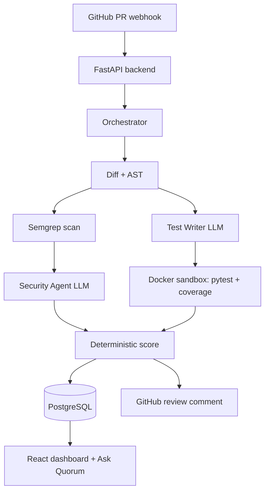

## Introduction

Every pull request review starts with the same quiet question: is this actually
safe to merge? A reviewer has to read the diff, guess whether a change breaks
something, spot security problems, and decide based on experience and gut
feeling. That judgement is slow, inconsistent, and easy to get wrong. Worse,
most AI review tools answer with a confident comment that cannot be verified.
I built Quorum to replace that confidence with measured evidence.

## Project Overview

| Category | Details |
| --- | --- |
| Project Name | Quorum |
| Purpose | Automated, evidence-based GitHub Pull Request review with a deterministic readiness score |
| Tech Stack | Python, FastAPI, PostgreSQL, React, TypeScript, Semgrep, OpenAI, Docker |
| Duration | 8 weeks (Aug-Sep 2026) |
| Role | Backend architecture, AI pipeline, GitHub integration, dashboard |

Quorum installs as a GitHub App. When a pull request is opened or updated,
GitHub delivers a webhook to the backend, and an orchestrator runs a review
pipeline: it extracts the diff, parses the changed Python with the standard
`ast` module, runs Semgrep for security evidence, asks an LLM Security Agent to
reason over that evidence, generates `pytest` tests with a Test Writer agent,
runs them in a hardened Docker sandbox, and measures coverage before and after.

All of that is combined into a Merge Readiness Score from 0 to 100, stored in
PostgreSQL, posted back to the pull request as a comment, and shown in a React
dashboard. The dashboard also includes Ask Quorum, an assistant that answers
questions about a specific review using only that review's evidence.

## Architecture / How It Works



The backend is the system boundary. The React dashboard talks only to the
FastAPI REST API and never touches the database, Docker, Semgrep, the LLM, or
GitHub secrets directly. The orchestrator runs as a background task so the
webhook response is never blocked.

## Key Implementation Details

### Keeping the score deterministic

The score must never be invented by a language model, so I compute it from
measured evidence only. Security findings, test outcomes, and coverage each
subtract points from 100, and the same evidence always produces the same score.

```python
def compute_merge_readiness_score(security_findings, test_outcomes,
                                  coverage_after, skip_non_code_deductions=False):
    # Security Agent findings and coverage are measured, not guessed
    security = _security_deduction(security_findings)      # -20 high, -10 medium, -5 low
    tests = 0 if skip_non_code_deductions else _test_deduction(test_outcomes)
    coverage = 0 if skip_non_code_deductions else _coverage_deduction(coverage_after)
    score = max(0, min(100, 100 - security - tests - coverage))
    return MergeReadinessResult(score=score, recommendation=recommendation_for(score))
```

### Grounding the Security Agent in evidence

An LLM that is asked to "find security issues" happily invents them, so the
Security Agent may only reason over real Semgrep findings. Every reported
finding is checked against the Semgrep output and the changed files; anything
unsupported is discarded.

```python
# Drop any finding that does not map back to a real Semgrep result
filtered = filter_unsupported_findings(review, context.semgrep_findings,
                                       context.changed_files)
```

### Running generated tests safely

Generated tests are untrusted code, so they never run on the host. Each run
happens in a fresh container with no network, a memory cap, a process limit, a
read-only workspace, and a hard timeout, then the container is removed.

```bash
# Hardened, short-lived sandbox invoked per analysis run
docker run --rm --network none --memory 256m --pids-limit 256 \
  --read-only --tmpfs /tmp:size=64m \
  -v "$WORKSPACE:/workspace:ro" -w /workspace quorum-sandbox:latest \
  python -m pytest -q
```

### Making Ask Quorum answer only from evidence

The chatbot can only answer from the selected review, and it now receives the
score breakdown so it can explain a score instead of deflecting. When a score
is not self-explanatory, the context supplies the exact deductions.

```python
def _score_text(review):
    # Reconstruct the breakdown so the assistant can explain, not guess
    security = _security_deduction(review.security_findings)
    tests = _test_deduction(review.test_runs)
    return (f"Merge Readiness: {review.merge_readiness_score}/100. "
            f"Score breakdown: 100 - {security} - {tests} - ...")
```

## Demo

The video walks through connecting a repository, reviewing a pull request, and
explaining the Merge Readiness Score end to end.

[](https://drive.google.com/file/d/19-fN5MIyMPMrR8UVtf1IV9KvZa6arSMy/view?usp=drive_link)

## Challenges & Lessons Learned

- Keeping the LLM from overstepping was the central design problem. The fix was
  to make the model a reasoner over evidence rather than the source of truth.
- GitHub API calls were the most failure-prone step. Early on, the default
  five-second HTTP timeout killed entire analyses on a slow connection. I added
  a longer timeout and retries with backoff, which made runs reliable.
- Running generated tests demanded strict isolation. Getting the Docker sandbox
  to enforce no-network, memory, and process limits took more care than the
  analysis code itself.
- If I did it again, I would add a lightweight CI pipeline earlier and write the
  reproducible evaluation harness before the UI, so accuracy could be tracked
  from the start.

## Results / Impact

- Deterministic Merge Readiness Score with a persisted breakdown, verified
  against real analyses.
- Isolated execution of generated pytest tests with measured coverage deltas.
- 679 backend tests and 119 frontend tests passing.
- A grounded chatbot that explains a score using only that review's evidence.

## Conclusion

Quorum taught me that the value of AI in code review is not a confident answer
but a verifiable one. By separating reasoning from measurement, keeping the LLM
behind an interface, and running untrusted code in a sandbox, I built something
that reports what it actually measured instead of what sounds plausible.

## Links

- [GitHub Repository](https://github.com/Saiful-alam105/Quorum)
- [Demo Video](https://drive.google.com/file/d/19-fN5MIyMPMrR8UVtf1IV9KvZa6arSMy/view?usp=drive_link)
