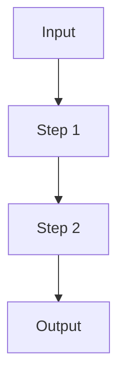

# Blog Post Template

Template for writing Chirpy blog posts. This file lives in `docs/` which is
excluded from the Jekyll build, so it is **never deployed**. To write a post,
copy the template below into `_posts/` and fill it in.

## How to Publish a Post

1. Copy the template into `_posts/YYYY-MM-DD-post-slug.md` (use today's date).
2. Fill in the front matter and sections.
3. Put any images in `assets/img/` and reference them as `/assets/img/<file>.png`.
4. Build and check: `.\tools\test.ps1` (or `bundle exec jekyll build`).

## Front Matter Template

```yaml
---
title: A Specific, Compelling Title Under 60 Characters
date: "YYYY-MM-DD HH:MM:SS +0600"
categories: [projects]   # or [blog] for non-project posts
tags: [tag1, tag2, tag3] # 3-6 lowercase keywords
mermaid: true            # only if you include a Mermaid diagram
toc: true
---
```

Notes:
- Always **quote the `date`** value — the colons break YAML otherwise.
- Use a single category: `[projects]` or `[blog]`.
- `mermaid: true` is required for Mermaid diagrams to render.

## Section Skeleton

Write the post using these sections in this order:

````markdown
## Introduction

One hook paragraph: what problem motivated the project.

## Project Overview

| Category | Details |
| --- | --- |
| Project Name | ... |
| Purpose | ... |
| Tech Stack | ... |
| Role/Contributions | ... |

## Architecture / How It Works



## Key Implementation Details

### A specific technical challenge

Explain the challenge, then show a short code snippet.

```python
# short, self-contained snippet under 25 lines
```

## Challenges & Lessons Learned

- Bullet point of a real difficulty and how you solved it.
- Bullet point of something you would do differently.

## Results / Impact

- Bullet with a concrete number where possible (accuracy, latency, users).

## Conclusion

Two or three sentences summarizing what the project taught you.

## Links

- [GitHub Repository](https://github.com/Saiful-alam105/<repo>)
````

## Rules

- First person, concise, no marketing fluff, no emojis.
- Code snippets must be short, self-contained, and in fenced blocks with a language label.
- Standard Markdown only — no raw HTML for layout.
- Keep images inside `assets/img/`.

## Related

- [PROMPT.md](PROMPT.md) — the ChatGPT prompt that turns a project into a draft post.
- [projects-card-template.md](projects-card-template.md) — card template for the Projects page.